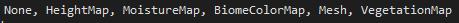
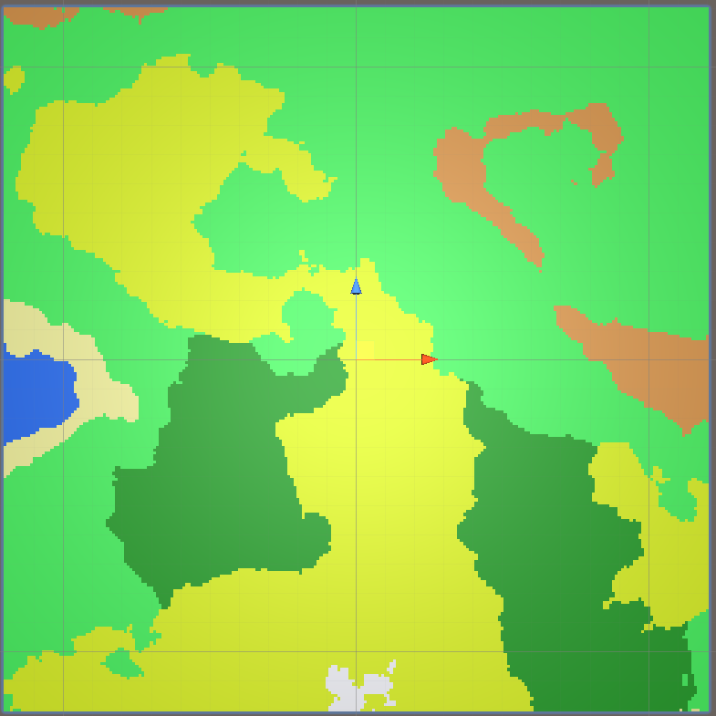

# Biome and Vegetation Procedural Content Generation

This project is a terrain Procedural Content Generation featuring a vegetation position generation based generated biomes.

## How to compile ?

Download Unity in version [2020.1.6f1 or above](https://unity3d.com/fr/get-unity/download).
Copy this project and open it in Unity with the previous download version.
Inside the *Scenes* folder, you will find the SampleScene of the project. Open it and you should see the following **Hierarchy** panel : 

<b>Fig 1 : Hierarchy view</b>

## How to use ?

The *viewer* prefab is our player. It's a simple cube with a camera. In the **Scene** panel, you can move it around while the project is running (Play button). You should see chunks appearing and disappearing around our *Viewer* prefab.

*MapGenerator* gameObject contains everything we need to know. 3 scripts are attached to this component :

- **MapGenerator** : Where the magic happens ! Almost every variable here is used either in Editor mode or Runtime mode. Here is the list of variables and what they are used to do (See screenshot below) :

  - **DrawMode** is a enumeration with multiple values possible. 
    Each value draw something different on both *Plane* and *Mesh* gameObjects.
    - *None* : draws nothing (obviously :) )
    - *HeightMap* : draw the height map as a simple texture.
    - MoistureMap, draw the moisture map as a simple texture.
    - *BiomeColorMap*, from the *HeightMap* & the *MoistureMap*, it draws the biome colors as a simple texture.
    - Mesh : generate a mesh and apply the *BiomeColorMap* on top of it. (**it is inverted on an axis but does not create any issue**)
    - VegetationMap : draw the vegetation map (simple points) as a simple texture.

  - **NormalizeMode** is either <u>Local</u> or <u>Global</u>. This is used to normalize values between chunks for a seemless experience. I recommend keeping it to <u>Global</u>.

  - **EditorPreviewLOD** lets us preview the LOD level in Editor mode when the *DrawMode* is set to <u>Mesh</u>.

  - **NoiseScale** is a simple scale. The bigger the value is, the larger perlin noise maps are generated, resulting in larger biomes.

  - **Octaves** used to add details to the perlin noise maps. More octaves, more details. The influence of each octave exponentially decrease.

    - **Persistance** : Affect how rapidly the amplitude decrease for each octave. 0.5 is a good value.

  - **Lacunarity** : More lacunarity results in more details for each octave. 2 is a good value.

  - **SeedHeight** : The seed used for the height map random generator.

  - **SeedMoisture** : The seed used for the moisture map random generator.

  - **SeedVegetation** : The seed used for the vegetation list random generator.

  - **NewPointsCount** : Affect how many new vegetation spawn point is compute for each sample point.

  - **Offset** : Offset to slighly move the generated maps.

  - **MeshHeightMultiplier** : The y-axis scale.

  - **MeshHeightCurve** : an Unity AnimationCurve. Can be used to flatten or straighten surfaces depending on their HeightMap value. Here's an example where Water and Sand are flatten while mountains are straighten :

    

    
<b>Fig 2 : AnimationCurve</b>

    

  - **AutoUpdate** : to update view automatically in Editor mode. I recommend keeping it checked.

  

  
<b>Fig 3 : MapGenerator script in Inspector view</b>

  

  - **Regions** : Define our biomes depending on their <u>starting</u> height and moisture values. Each biome hold it's own color, vegetation prefab and minimum distance between each vegetation.

    Each biome must be defined in height then moisture order. Here is my example :

    

    
<b>Fig 4 : Biomes</b>

    
x-axis = moisture and y-axis = height

    

    I have 8 different biomes with their own color. I decided to order biomes depending on their height and moisture values, so that I only need to cycle in a single list and stop when I found the correct biome. Plus, in order to keep things simple, I decided to cut biomes and multiple rectangles :

    

    
<b>Fig 5 : Biomes cut</b>

    
x-axis = moisture and y-axis = height

    This way, we only need <u>starting</u> height and moisture values, but it means we night to define more biomes. (11 here) :

    

    
<b>Fig 6 : Biomes in Inspector</b>

- **MapDisplay** : Simple component where *Plane* and *Mesh* gameObjects are linked. This script is only use to draw data in Editor mode. (Very useful to understand what we generate before playing !).

- **EndlessTerrain** : Script only used at runtime to generate an endless terrain with multiple chunks. It features multiple parameters. (See screenshot below)
  - Detail levels : the level of details information. Since we use an endless terrain generator, we certainly need multiple level of details for performance.
    It is a simple array of different LOD levels defined by the user. 
    **Each LOD must be in order from closer to farther.**
    We can choose between 6 different LOD levels (**Lod** field).
    A threshold value must be defined for each LOD level. It must be **above** the previous LOD threshold value. This value represent the maximum range for the current level.
    Lastly, a Boolean is used to show or hide the vegetations for the current LOD.
  - We also link the player and the map material. These map is generated to color the map.

<b>Fig 7 : EndlessTerrain script in Inspector</b>

In this example we have 3 LOD level :

- LOD 1, range 0-200 with vegetations. It's the higher definition possible in this project.
- LOD 2, range 200-400 without vegetations.
- LOD 3, range 400-600 without vegetations.
- Above 600, everything is hided.

## How does it work ?

### HeightMap & MoistureMap

I generated height and moisture maps with a Perlin Noise. With this, the map can actually be endless.

<b>Fig 8 : HeightMap</b>

<b>Fig 8 : MoistureMap</b>

With these two maps, I can generate the biome texture :

<b>Fig 9 : Biome texture</b>

Applying these result on the generated mesh :

<b>Fig 10 : Mesh with biome texture and height</b>

### Vegetation sampling

I used the Poisson Disk Sampling to generate points that are not overlapping other points depending on a radius. This algorithm can be resumed as a simple propagation algorithm. We generate a random point on the terrain. From it, we try to generate multiple points (Remember **NewPointsCount** variable ?). If the new point is not overlapping and inside the terrain we add it to the list. And we continue to propagate from the newly added points.

It result in a very cool looking texture : 

<b>Fig 11 : Poisson Disk Sampling points</b>

With a minimum distance set to 3

This result cannot be used directly on our terrain : each biome has it's own minimum distance and sometimes no vegetations at all !
So I decided to compute a sampling for each biome, and to merge them into a single one. The only thing I added is verification to check if a point is inside the correct biome as Poisson Disk Sampling cannot generate empty spaces by itself.

Here is the final result where we can see forest and tropical forest :

<b>Fig 12 : Poisson Disk Sampling points depending on biomes</b>

## Final Result

After merging everything, we have a very cool looking result :

<b>Fig 13 : Final result !</b>

And here is a funny error I had while playing with parameters :

## Going further

The AnimationCurve used to flatten or straighten the map only takes the heightMap in account. It could be better to have a AnimationSurface object working the same way AnimationCurve does but with 2 entries : heightMap and moistureMap.

And some minor good looking adjustments :

- Create a good-looking texture instead of simple rectangles.
- Randomize the scale and/or the rotation of each tree.
- Place the tree in the normal direction of the surface.

# Sources / Inspirations

*FireSpark website* - https://firespark.de/?id=article&article=ProceduralGenerationResources - A compilation of a lot of PCG from all around the world. It helped me found ideas.

*Sebastian Lague Youtube tutorials* - https://www.youtube.com/playlist?list=PLFt_AvWsXl0eBW2EiBtl_sxmDtSgZBxB3 - Helped a lot in understanding and creating a base code with height maps.

*Red Blob Games website* - https://www.redblobgames.com/maps/terrain-from-noise/ - A great website explaining how biomes could work with Perlin Noise and an introduction to vegetation sample position.

*Dev.Map website* - http://devmag.org.za/2009/05/03/poisson-disk-sampling/ - The article I read the most. It explains how Poisson Disk Sampling algorithm works with some pseudo code. I integrated it in my Unity project.

*Asset Store Unity* - https://assetstore.unity.com/packages/3d/vegetation/trees/free-trees-103208 - Small free asset package with 4 tree type.